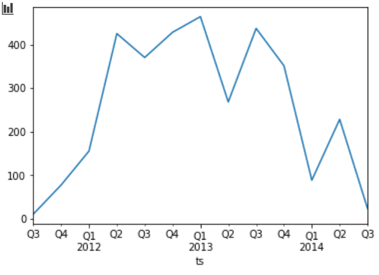

## ACT 1 - Log Analysis
### Participants 
    Eric Gómez - A01378838
    Felipe Osornio - A01377154
    Rafael Moreno - A01378916
    Uriel Pineda - A01379633
    Hector Hernandez - A01374009

# Introduction

Currently, the amount of information that transit through the Internet is wide. With these large data volumes one of the best uses that can be given is the identification of patterns or anomalies in the network traffic applied in safety issues. From there, it is that the need to use tools that help us from the information processing to observe behaviors that will not be glimpsed at first glance.

In the subsequent work, an analysis of two different files that include information on network traffic will be made.Both files are a set of record collected by Zeek IDS, which works as a network traffic analyzer in a passive way, as well as free use.

Within the activities that were carried out, they were included:

- The conversion of raw data to significant information.
- HTTP packets search for ones that did not use conventional ports (80 and 8080). 
- Graphs sectioned by periods.
- Identification of types of executables and common exploits.

This with the purpose of observing relevant information that could be helpful for business research or improvements.

# Methodology

The analysis was made according to the following two files [conn.log](https://experience21.tec.mx/courses/112876/files/42291245/download?download_frd=1) and [http.log](https://experience21.tec.mx/courses/112876/files/43820536/download?download_frd=1).

The first file (`conn.log`) is data collection with the following attributes: `ts`, `uid`, `id.orig_h`, `id.orig_p`, `id.resp_h`, `id.resp_p`, `proto`, `service`, `duration`, `orig_bytes`, `resp_bytes`, `conn_state`, `local_orig`, `missed_bytes`, `history`, `orig_pkts`, `orig_ip_bytes`, `resp_pkts`, `resp_ip_bytes`, `tunnel_parents`, `threat` and `sample`.

As this file contained around 22.6 million inputs, it is limited to only take a sample of 10%, which would be equivalent to 2.2 million tickets to analyze. Likewise, the files were transformed to the binary parquet format. Decreasing the execution time and use in memory.

In the next code you can observe different aspects that describe the way in which the data set is manipulated:

```python
<class 'pandas.core.frame.DataFrame'>
RangeIndex: 2269436 entries, 0 to 2269435
Data columns (total 3 columns):
 #   Column     Dtype         
---  ------     -----         
 0   ts         datetime64[ns]
 1   id_orig_h  object        
 2   id_resp_p  int64         
dtypes: datetime64[ns](1), int64(1), object(1)
memory usage: 51.9+ MB
None
```

- The exact amount of registers was 2269436.
- Only three columns of the total attributes were taken (`ts`,` id.orig_p`, `id.resp_p`).
- The time stamp was manipulated to another type of object for performing series-time analysis.

En la siguiente impresión se muestran las veces que se contaron la IP de origen correspondiente 

The following impression shows the count that the corresponding IP connects to a any port other than 80.

```python
 Different ports to 80: 
                                               count
id_orig_h                           id_resp_p       
192.168.204.45                      443         4865
2001:dbb:c18:202:20c:29ff:fe18:b667 445         4840
192.168.202.110                     443         3973
192.168.202.140                     443         3664
192.168.202.108                     443         3447
...                                              ...
192.168.202.110                     48469          1
                                    48479          1
                                    48481          1
                                    48529          1
192.168.202.79                      35803          1

[266880 rows x 1 columns]
```

The second file (`http.log`) Defined according to the following attributes:`ts`, `uid`, `id_orig_h`, `id_orig_p`, `id_resp_h`, `id_resp_p`, `trans_depth`, `method`, `host`, `uri`, `referrer`, `user_agent`, `request_body_len`, `response_body_len`, `status_code`, `status_msg`, `info_code`, `info_msg`, `filename`, `tags`, `username`, `password`, `proxied`, `orig_fuids`, `orig_mime_types`, `resp_fuids`, `resp_mime_types` and `sample`; It was filtered so that only the relevant fields according to the following impression will be shown:

```python
<class 'pandas.core.frame.DataFrame'>
RangeIndex: 807537 entries, 0 to 807536
Data columns (total 4 columns):
 #   Column           Non-Null Count   Dtype         
---  ------           --------------   -----         
 0   ts               807537 non-null  datetime64[ns]
 1   id_orig_h        807537 non-null  object        
 2   id_resp_p        807537 non-null  int64         
 3   resp_mime_types  807537 non-null  object        
dtypes: datetime64[ns](1), int64(1), object(2)
memory usage: 24.6+ MB
None
```
The use in memory for this file is considerably low, in addition to that only four columns of the 28 attributes containing each entry of the log were taken.

The exception in this part of the analysis was to analyze all those ports different from 80 and 8080. And know the types of common executables and exploits.

```python
Different ports to 80 and 8080: 
                                 id_orig_h  id_resp_p        resp_mime_types
ts                                                                          
2011-07-30 09:38:13.349379   192.168.68.10         81              text/html
2011-08-13 16:31:10.361867    192.168.1.10         81              image/gif
2011-08-15 22:17:34.542855   192.168.36.10         81              image/gif
2011-08-16 07:15:15.135895  192.168.119.10         81              text/html
2011-08-28 05:38:14.486610  192.168.119.10         81              image/gif
...                                    ...        ...                    ...
2014-07-14 02:25:35.649867   192.168.67.10      19910  application/x-dosexec
2014-07-14 02:25:49.922045   192.168.67.10      19910              text/html
2014-07-14 02:25:50.045418   192.168.67.10      19910              text/html
2014-07-14 02:25:50.231042   192.168.67.10      19910              text/html
2014-07-14 02:25:50.240084   192.168.67.10      19910              text/html
```
The following graph exemplifies how the data of the previous printing was sectioned.



Finally, the data were segmented according to the following impression to generate a graph showing each quarter count of the connections that matches with the common executables and exploits.

```python
Exploit Types: ['application/x-java-applet', 'application/pdf', 'application/zip', 'application/jar', 'application/x-shockwave-flash']
Executable Types: ['application/x-dosexec', 'application/octet-stream', 'binary', 'application/vnd.ms-cab-compressed']
                                id_orig_h  id_resp_p  \
ts                                                     
2011-07-22 17:08:11.247202  192.168.95.10         80   
2011-07-22 17:08:14.015447  192.168.95.10         80   
2011-07-22 17:08:23.140325  192.168.95.10         80   
2011-07-22 17:08:49.264341  192.168.95.10         80   
2011-07-22 17:08:49.378921  192.168.95.10         80   
...                                   ...        ...   
2014-07-14 08:44:05.730220  192.168.29.10         80   
2014-07-14 08:44:06.603410  192.168.29.10         80   
2014-07-14 08:44:06.677585  192.168.29.10         80   
2014-07-14 08:44:06.687420  192.168.29.10         80   
2014-07-14 08:44:11.976348  192.168.29.10         80   

                                      resp_mime_types  
ts                                                     
2011-07-22 17:08:11.247202      application/x-dosexec  
2011-07-22 17:08:14.015447            application/pdf  
2011-07-22 17:08:23.140325      application/x-dosexec  
2011-07-22 17:08:49.264341  application/x-java-applet  
2011-07-22 17:08:49.378921            application/zip  
...                                               ...  
2014-07-14 08:44:05.730220                     binary  
2014-07-14 08:44:06.603410                     binary  
2014-07-14 08:44:06.677585                     binary  
2014-07-14 08:44:06.687420                     binary  
2014-07-14 08:44:11.976348      application/x-dosexec 
```


# Finds

```python
 Different ports to 80: 
                                               count
id_orig_h                           id_resp_p       
192.168.204.45                      443         4865
2001:dbb:c18:202:20c:29ff:fe18:b667 445         4840
```

In the first section when obtaining all origin IPS and the ports other than 80 of the `conn.log` file, we can notice that most income were through HTTPS (port 443), but it is another important fact that the second port mostly consulted was 445.

Port 445 is used for the `Server Message Block (SMB)` protocol. The protocol allows sharing information between files, printers, among others on Windows systems. However, it is also an open access to two types of worms: `Sasser` and` Nimda`.

`Sasser` works scanning a range of IP addresses and exploiting vulnerability through port 445. Its main function is buffer overflow on a key component known as` LSASS (Local Security Authority Subsystem Service )` inside a `Windows` machine.

On the other hand, `Nimda` has the purpose of extending its infection to other computer files or other devices with the same system (` Windows`) connected to the network.

Both worms can be easily eliminated by configuring the firewall to avoid traffic through port 445.

```python
Different ports to 80 and 8080: 
                                 id_orig_h  id_resp_p        resp_mime_types
ts                                                                      
2014-07-14 02:25:35.649867   192.168.67.10      19910  application/x-dosexec
2014-07-14 02:25:49.922045   192.168.67.10      19910              text/html
```

Taking reference the previous impression one of the types of applications is using the port 19910, what is not assigned any detail type. Possibly, the aforementioned computer worms executed applications in `Windows` through the port 19910.

On the other hand, an analysis of the graphic information can also be done.


> Fig.1 Connections to other ports than 80 and 8080

For example, in this first graph (Fig.1) the amount of times is shown by an IP and source port. At first glance we can see that the data changes according to the year and quarter. During 2012 and 2013 the data shows that there was great activity in terms of connections, there are three big peaks, the second and last quarters of 2012 and the third of 2013.


> Fig.2 Connections with common executable and exploit types

This graphic (Fig.2) as well as the above represents the number of attack types and common exploits that were recorded each trimester. It even emphasizes that during the second quarter of 2012 there was a strong number of records, far exceeding the data recovered in other quarters.

By observing these graphics, we could reinforce the idea that it was likely that during that time it was when the vulnerability of the system was exploited by injecting a large amount of executable files on which any type of worm could be working.

# Conclusion 

Performing the analysis of these two files (`conn.log` and` http.log`) it was possible to identify that possibly the system of which such bits were extracted could have suffered an exploitation of a vulnerability. However, this patron could not have been found without the correct manipulation and interpretation of the data.

While it is a vulnerability that could have caused important problems, tools such as antivirus, firewalls or amazing management protocols are sufficient aspects to cease the attempt to exploit a vulnerable system section.

Finally, performing this type of exercises periodically in the network infrastructure would help monitor latent threats with these features. Even the reading of `logs` and its interpretation could be automated through entry values and actions that require a fixed process from which only a pair of variables depend.