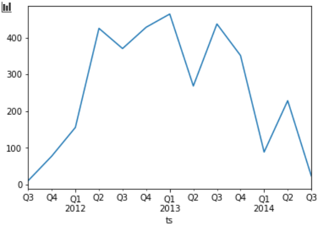
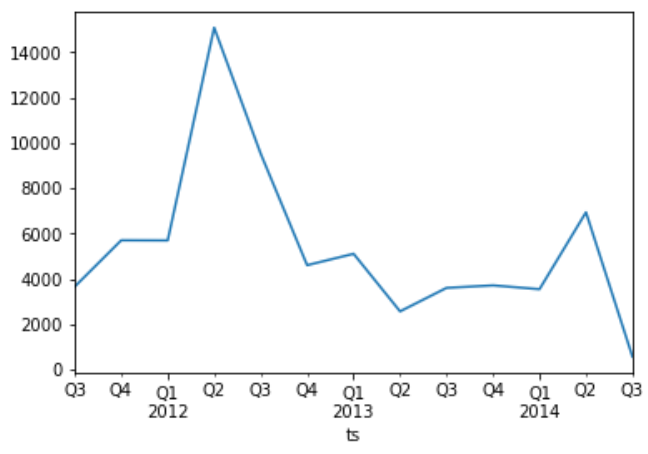

# Introduction

Actualmente, la cantidad de información que trasita a través del internet es amplia. Con estos grandes volumenes de datos uno de los mejores usos que se les puede dar es la identificación de patrones o anomalías en el tráfico de red aplicado en temas de seguridad. De ahí es que surje la necesidad de utilizar herramientas que nos ayuden al procesamiento de información para observar comportamientos que no se vislumbrar a simple vista. 

En el posterior trabajo, se hará un análisis de dos diferentes archivos que incluyen información sobre el tráfico de red. Ambos archivos son un conjunto de registro recolectados por Zeek IDS, el cual funciona como un analizador de tráfico de red de forma pasiva, además de ser de libre uso. 

Dentro de las actividades que se realizaron se incluyó:

- La conversión de datos crudos a información significativa.
- La búsqueda de paquetes HTTP que no utilizaron puertos convencionales (80 y 8080). 
- Gráficas seccionadas por periódos. 
- Identificación de tipos de ejecutables y explotaciones comúnes. 

Esto con la finalidad de observar información relevante que pudiera ser de ayuda para investigación o mejoras en el negocio. 

# Methodology

El análisis se hizo de acuerdo a los siguientes dos archivos [conn.log](https://experiencia21.tec.mx/courses/112876/files/42291245/download?download_frd=1) y [http.log](https://experiencia21.tec.mx/courses/112876/files/43820536/download?download_frd=1).

El primer archivo (`conn.log`) es un compedio de datos con los siguientes atributos: `ts`, `uid`, `id.orig_h`, `id.orig_p`, `id.resp_h`, `id.resp_p`, `proto`, `service`, `duration`, `orig_bytes`, `resp_bytes`, `conn_state`, `local_orig`, `missed_bytes`, `history`, `orig_pkts`, `orig_ip_bytes`, `resp_pkts`, `resp_ip_bytes`, `tunnel_parents`, `threat` y `sample`.

Como este archivo contenía alrededor de 22.6 millones de entradas se limito para tomar únicamente una muestra del 10%, lo cual equivaldría a 2.2 millones de entradas para analizar. Asimismo, los archivos fueron transformados al formato binario parquet. Disminuyendo el tiempo de ejecución y el uso en memoria. 

En el siguiente código se pueden observar diferentes aspectos que describen la forma en que se manipulo el conjunto de datos: 

```python
<class 'pandas.core.frame.DataFrame'>
RangeIndex: 2269436 entries, 0 to 2269435
Data columns (total 3 columns):
 #   Column     Dtype         
---  ------     -----         
 0   ts         datetime64[ns]
 1   id_orig_h  object        
 2   id_resp_p  int64         
dtypes: datetime64[ns](1), int64(1), object(1)
memory usage: 51.9+ MB
None
```

- La cantidad exacta de entradas fueron 2269436.
- Únicamente se tomarón tres columnas de los atributos totales (`ts`, `id.orig_p`, `id.resp_p`). 
- La estampa de tiempo fue manipulada a otro tipo de objeto para desempeñar series-time analysis.

En la siguiente impresión se muestran las veces que se contaron la IP de origen correspondiente 
a un puerto. 

```python
 different ports to 80: 
                                               count
id_orig_h                           id_resp_p       
192.168.204.45                      443         4865
2001:dbb:c18:202:20c:29ff:fe18:b667 445         4840
192.168.202.110                     443         3973
192.168.202.140                     443         3664
192.168.202.108                     443         3447
...                                              ...
192.168.202.110                     48469          1
                                    48479          1
                                    48481          1
                                    48529          1
192.168.202.79                      35803          1

[266880 rows x 1 columns]
```

El segundo archivo (`http.log`) definido de acuerdo a los siguietes atributos:  `ts`, `uid`, `id_orig_h`, `id_orig_p`, `id_resp_h`, `id_resp_p`, `trans_depth`, `method`, `host`, `uri`, `referrer`, `user_agent`, `request_body_len`, `response_body_len`, `status_code`, `status_msg`, `info_code`, `info_msg`, `filename`, `tags`, `username`, `password`, `proxied`, `orig_fuids`, `orig_mime_types`, `resp_fuids`, `resp_mime_types` y `sample`; fue filtrado para que solo se mostraran los campos relevantes conforme a la siguiente impresión: 

```python
<class 'pandas.core.frame.DataFrame'>
RangeIndex: 807537 entries, 0 to 807536
Data columns (total 4 columns):
 #   Column           Non-Null Count   Dtype         
---  ------           --------------   -----         
 0   ts               807537 non-null  datetime64[ns]
 1   id_orig_h        807537 non-null  object        
 2   id_resp_p        807537 non-null  int64         
 3   resp_mime_types  807537 non-null  object        
dtypes: datetime64[ns](1), int64(1), object(2)
memory usage: 24.6+ MB
None
```

Al igual que en el caso anterior el uso en memoria es considerablemente bajo, además de que se tomaron solo cuatro columnas de los poco más de 28 atributos que contiene cada entrada de la bitacóra. 

La excepción en esta parte del análisis fue que se decidió analizar todo aquellos puertos diferentes al 80 y 8080; y conocer los tipos de ejecutable y explotaciones comúnes de acuerdo 

```python
Different ports to 80 and 8080: 
                                 id_orig_h  id_resp_p        resp_mime_types
ts                                                                          
2011-07-30 09:38:13.349379   192.168.68.10         81              text/html
2011-08-13 16:31:10.361867    192.168.1.10         81              image/gif
2011-08-15 22:17:34.542855   192.168.36.10         81              image/gif
2011-08-16 07:15:15.135895  192.168.119.10         81              text/html
2011-08-28 05:38:14.486610  192.168.119.10         81              image/gif
...                                    ...        ...                    ...
2014-07-14 02:25:35.649867   192.168.67.10      19910  application/x-dosexec
2014-07-14 02:25:49.922045   192.168.67.10      19910              text/html
2014-07-14 02:25:50.045418   192.168.67.10      19910              text/html
2014-07-14 02:25:50.231042   192.168.67.10      19910              text/html
2014-07-14 02:25:50.240084   192.168.67.10      19910              text/html
```

La siguiente gráfica ejemplifica como fue seccionada los datos de la impresión anterior. 



Por último, los datos fueron segmentados de acuerdo a la siguiente impresión para generar una gráfica mostrando cada cuarto los tipos de ejcución y explotaciónes comunes conforme a la IP de origin junto con el puerto. 

```python
Exploit Types: ['application/x-java-applet', 'application/pdf', 'application/zip', 'application/jar', 'application/x-shockwave-flash']
Executable Types: ['application/x-dosexec', 'application/octet-stream', 'binary', 'application/vnd.ms-cab-compressed']
                                id_orig_h  id_resp_p  \
ts                                                     
2011-07-22 17:08:11.247202  192.168.95.10         80   
2011-07-22 17:08:14.015447  192.168.95.10         80   
2011-07-22 17:08:23.140325  192.168.95.10         80   
2011-07-22 17:08:49.264341  192.168.95.10         80   
2011-07-22 17:08:49.378921  192.168.95.10         80   
...                                   ...        ...   
2014-07-14 08:44:05.730220  192.168.29.10         80   
2014-07-14 08:44:06.603410  192.168.29.10         80   
2014-07-14 08:44:06.677585  192.168.29.10         80   
2014-07-14 08:44:06.687420  192.168.29.10         80   
2014-07-14 08:44:11.976348  192.168.29.10         80   

                                      resp_mime_types  
ts                                                     
2011-07-22 17:08:11.247202      application/x-dosexec  
2011-07-22 17:08:14.015447            application/pdf  
2011-07-22 17:08:23.140325      application/x-dosexec  
2011-07-22 17:08:49.264341  application/x-java-applet  
2011-07-22 17:08:49.378921            application/zip  
...                                               ...  
2014-07-14 08:44:05.730220                     binary  
2014-07-14 08:44:06.603410                     binary  
2014-07-14 08:44:06.677585                     binary  
2014-07-14 08:44:06.687420                     binary  
2014-07-14 08:44:11.976348      application/x-dosexec 
```



# Finds

# Conclusion 